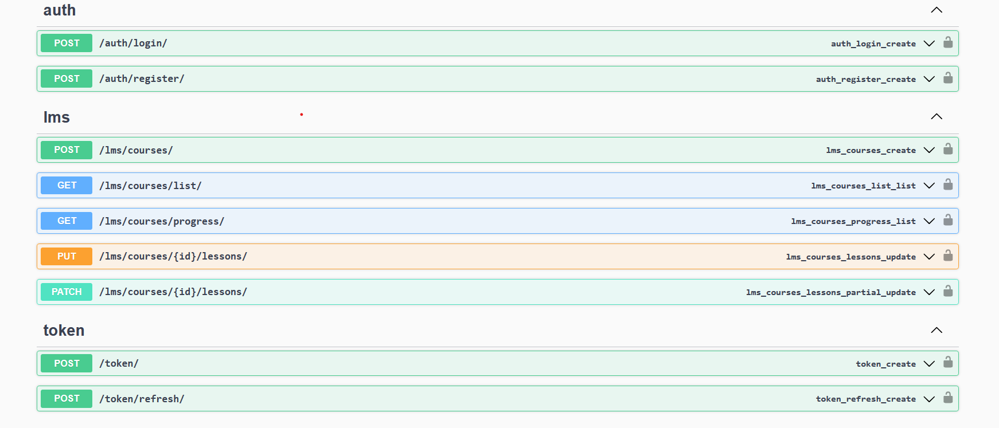

Installation

    clone the repo 
    install the requirements.txt
    python manage.py makemiragtions
    python manage.py makemiragtions
    #fill dummy data to test
    python manage.py fillData  
    #run test
    pytest
    #to view apis
    link : http://127.0.0.1:8000/swagger/  

    
